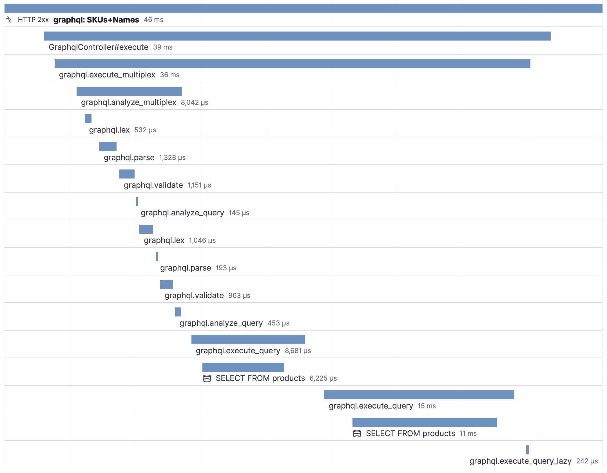

# GraphQL transactions and spans

**NB:** This document is not guaranteed to be final.

## Problems with our current approach

Grouping transactions by HTTP method and path fits perfectly for REST-style APIs and the like.

With a GraphQL API, the client always requests the same endpoint.
This means queries and mutations with very different costs and consequences all end up in the same transaction group.
Spans are likewise impossible to tell apart.

This document describes and explains a common approach to better support GraphQL.

Example GraphQL query:

```graphql
{
  user(id: "99") {
    name
    comments {
      body
    }
  }
}
```

Turns into an HTTP POST request like so:

```plain
POST /graphql
Content-Type: application/json

{
  "query": "query ($id: ID!) {
    user(id: $id) {
      name
      comments {
        body
      }
    }
  }",
  "variables": { "id": "99" }
}
```

**Sidenote:** The Node.js agent already supports GraphQL. This document is written with that in mind but not necessarily with its implementation as a target result.

## Transactions

### Prefix

To distinguish GraphQL transactions from others we prefix them with `GraphQL:`.

### Operation Name

It is common (and [recommended](https://graphql.org/learn/queries/#operation-name)) to provide an _Operation Name_ for queries. Here for example `UserWithComments`:

```graphql
query UserWithComments {
  user {
    id
    name
    comments {
      body
    }
  }
}
```

The point of these are to provide an easy way for the developers, when things go wrong, to pinpoint where exactly they did so.

This name is available on the server too and serves as a great distinguishing key.

Transaction name examples:
- `GraphQL: UserWithComments`
- `GraphQL: UpdateUser`

#### Sidenote: Multiple endpoints

The Node.js implementation adds the request path to the GraphQL span names.

We do not find serving multiple endpoints and using them with the same Operation Names likely enough to add it to this document.

### Anonymous queries

An Operation Name isn't required. When one isn't provided it's hard for us to tell apart the queries.

We considered hashing queries to tell them apart, but decided against it.
Instead we will just consider all unnamed queries _unnamed_ and consequently put them in the same bucket.

<details>
<summary>Rationale:</summary>

1. Some clients generate `id`s from hashing the contents of the query (see [apollo-tooling](https://github.com/apollographql/apollo-tooling/blob/1dfd737eaf85b89b2cfb13913342e091e3c03d18/packages/apollo-codegen-core/src/compiler/visitors/generateOperationId.ts#L5)). This would split the anonymous queries into separate buckets.

    A problem with this approach is that a user of the APM UI has no way to recognise queries in the transactions list before clicking through.

    Using just the `id` will not reveal the true culprit since there can be variables associated with the query. Different values for the variables can lead to very different workloads and response times.

2. Another approach is to simply label them `[unnamed]`.

    A problem with _that_ approach is that the contents and thereby the relevant db queries and other sub-span actions that the server might do while resolving these queries may be wildly different making it hard to provide a _true_ sample waterfall.

    These two examples for example will look the same for the top-level GraphQL spans but will represent significantly different workloads.

    ```
    [- anonymous graphql span --------------]
      [- 1,000x SELECT * ---------------]
        [- 1,000 more SELECT * -]

    [- anonymous graphql span --------------]
      [- SELECT id FROM users WHERE id=? -]
    ```

No one of these are perfect. Because the benefits of using `id`s in the worst case could be misleading anyway, we're going with option 2.
</details>

To further help and nudge developers to use Operation Names for their queries, a tooltip will be shown in the Kibana UI, suggesting to use Operation Names.

Transaction name examples:
- `GraphQL: [unnamed]`

### Batching/Multiplexing queries

Some clients and servers allow batching/multiplexing queries (see for example [apollo-link-batch-http](https://www.apollographql.com/docs/link/links/batch-http/#gatsby-focus-wrapper) or [dataloader](https://github.com/graphql/dataloader#batching)) allowing multiple queries to be run from the same HTTP request.

If multiple queries are run from the same request, we join their operation names in the transaction name with a `+`.

Transaction name examples:
- `GraphQL: UserWithComments+PostWithSiblings+MoreThings+[unnamed]`

To avoid very long transaction names, if a request has more than five queries, we abbreviate it to `[more-than-five-queries]`.

Transaction name examples:
- `GraphQL: [more-than-five-queries]`

## Spans

The life cycle of responding to a GraphQL query is mostly split in two parts. First, the quer(y/ies) are read, parsed and analyzed. Second, they are executed.



This example shows the server responding to one request, with two named queries, `SKUs` and `Names`.

As each language's server implementation can vary slightly in phases and their names, these might be named differently between agents.

GraphQL spans have the following parameters:

- `name: graphql.[action]`
- `type: "app"`
- `subtype: "graphql"`
- `action: [action]`
