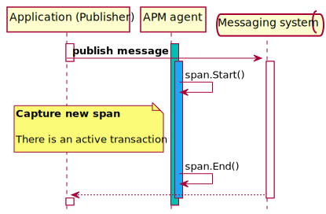

# Messaging Systems

The instrumentation of messaging systems includes:

- Transaction creation for received message processing, either as a child
of the message sending span if the sending operation is traced (meaning
distributed tracing support), or as root
- Span creation for message sending operation
- Span creation for message *receiving operation that occurs within a traced transaction*

## Message sending/publishing

A Message send/publish SHOULD be captured as a `messaging` span only if
occurring within a traced transaction.

### Sending Trace Context

If the messaging system exposes a mechanism for sending additional [message metadata](#message-metadata), it
SHOULD be used to propagate the [Trace Context](https://www.w3.org/TR/trace-context/) of the
`messaging` span, to continue the [distributed trace](tracing-distributed-tracing.md).

## Message reception/consumption

Message reception can be divided into two types, **passive** and **active**.

### Passive message reception

Passive message reception typically involves a listener or callback subscribed
to a queue/topic/subscription that is called once a message or batch of messages
is available, and passed the message or batch of messages for processing.

Passive reception SHOULD be captured as a `messaging` transaction that starts when
a message or batch of messages is received for processing, and ends when the
processing of the message or batch of messages finishes.

### Active message reception

Active message reception typically involves initiating the reception of a
message or batch of messages from a queue/topic, on demand. This might be a
blocking or non-blocking operation, and for the purposes of this spec, is
collectively referred to as polling.

When message polling is performed within a traced transaction, it SHOULD be
captured in a `messaging` span with a name indicating a poll action. A
span SHOULD be created irrespective of whether the operation returns any messages.

If message polling is performed when there is no active transaction, it
can be the initiating event for a message processing flow. Our goal in this
scenario is to capture the message processing flow as a `messaging` transaction
that SHOULD start after the polling operation exits **and** MUST only be started
if the polling operation returned a message or batch of messages. Capturing
the message processing flow in a transaction in this manner may be unfeasible if
the processing flow is not implemented within a well defined API.

### Batch message processing

When active or passive message reception results in receiving a batch of messages,
a `messaging` transaction SHOULD be started and ended for the processing
of each message in the batch, if possible. For example, the Java agent
instruments the Kafka consumer batch iterator so that a transaction is started whenever
a message is retrieved from the batch, and ended either when the next message
is retrieved, or when the iterator is depleted i.e. `iterator.hasNext()` returns
`false`.

If creating a transaction for the processing of each message in a batch is not possible,
the agent SHOULD create a single `messaging` transaction for the processing of the batch
of messages.

### Receiving Trace Context

This section applies to messaging systems that support [message metadata](#message-metadata).
The instrumentation of message reception SHOULD check message metadata for the
presence of [Trace Context](https://www.w3.org/TR/trace-context/).

When single message reception is captured as a `messaging` transaction,
and a Trace Context is present, it SHOULD be used as the parent of the `messaging` transaction
to continue the [distributed trace](tracing-distributed-tracing.md).

Otherwise (a single message being captured as a `messaging` span, or a batch
of messages is processed in a single `messaging` transaction or span), a
[span link](span-links.md) SHOULD be added for each message with Trace Context.
This includes the case where the size of the batch of received messages is one.

The number of events processed for trace context SHOULD be limited to a maximum
of 1000, as a guard on agent overhead for extremely large batches of events.
(For example, SQS's maximum batch size is 10000 messages. The maximum number of
span links that could be sent for a single transaction/span to APM server with
the default configuration is approximately 4000: 307200 bytes
[APM server `max_event_size` default](https://www.elastic.co/guide/en/apm/server/current/configuration-process.html#max_event_size)
/ 77 bytes per serialized span link.)

### Examples

#### Kafka consumer

A Kafka consumer consumes data in a loop from one or more topics, as part of a
consumer group. A `Consume()` method retrieves records one-by-one for processing.
Upon entering a consume loop, an APM agent SHOULD check if there is an active
`messaging` transaction for consumption, and end it. Following a `Consume()`
method returning a message, an APM agent SHOULD start a `messaging` transaction
to capture the message handling flow. Upon exiting a consume loop, an APM agent SHOULD check if there is an active `messaging` transaction for consumption, and end it.

### Typing

- Transactions:
  - `transaction.type`: `messaging`
- Spans:
  - `span.type`: `messaging`
  - `span.subtype`: depends on service/provider, see table below
  - `span.action`: `send`, `receive` or `poll`

| `subtype`           | Description                       |
| ------------------- | --------------------------------- |
| `azurequeue`        |  Azure Queue                      |
| `azureservicebus`   |  Azure Service Bus                |
| `jms`               |  Java Messaging Service           |
| `kafka`             |  Apache Kafka                     |
| `rabbitmq`          |  RabbitMQ                         |
| `sns`               |  AWS Simple Notification Service  |
| `sqs`               |  AWS Simple Queue Service         |

### Naming

Transaction and span names *should* follow this pattern: `<MSG-FRAMEWORK> SEND/RECEIVE/POLL to/from <QUEUE-NAME>`.
Examples:
- `JMS SEND to MyQueue`
- `RabbitMQ RECEIVE from MyQueue`**
- `RabbitMQ POLL from MyExchange`**

Agents may deviate from this pattern, as long as they ensure a proper cardinality is maintained, that is- neither too low nor too high.
For example, agents may choose to name all transactions/spans reading-from/sending-to temporary queues equally.
On the other end, agents may choose to append a cardinality-increasing factor to the name, like the routing key in RabbitMQ.

\* At least up to version 1.19.0, the Java agent's instrumentation for Kafka does not follow this pattern.

#### \** RabbitMQ naming specifics

In RabbitMQ, queues are only relevant in the receiver side, so the exchange name is used instead for sender spans.
When the default exchange is used (denoted with an empty string), it should be replaced with `<default>`.

Agents may add an opt-in config to append the routing key to the name as well, for example: `RabbitMQ RECEIVE from MyExchange/58D7EA987`.

For RabbitMQ transaction and polling spans, the queue name is used, whenever available (i.e. when the polling yields a message).
RabbitMQ broker can generate a unique queue name on behalf of an application, which conforms to a naming convention starting with
`amq.gen-`. A generated queue name MUST be replaced with `amq.gen-*` when used in a span name, to reduce cardinality.

### Context fields

- **`context.message.queue.name`**: optional for `messaging` spans and transactions. Indexed as keyword. Wherever the broker terminology
uses "topic", this field will contain the topic name. In RabbitMQ, whenever the queue name is not available, use exchange name instead.
- **`context.message.age.ms`**: optional for message/record receivers only (transactions or spans).
A numeric field indicating the message's age in milliseconds. Relevant for transactions and
`receive` spans that receive valid messages. There is no accurate definition as to how this is calculated. If the messaging framework
provides a timestamp for the message, agents may use it (subtract the message/record timestamp from the read timestamp).
If a timestamp is not available, agents should omit this field or find an alternative and document it in this spec. For example, the
sending agent can add a timestamp to the message's metadata to be retrieved by the receiving agent.
Clock skews between agents are ignored, unless the calculated age (receive-timestamp minus send-timestamp) is negative, in which case the
agent should report 0 for this field.
- **`context.message.routing_key`**: optional. Use only where relevant. Currently only RabbitMQ.

#### Transaction context fields

- **`context.message.body`**: similar to HTTP requests' `context.request.body`- only fill in messaging-related **transactions** (ie
incoming messages creating a transaction) and not for outgoing messaging spans.
   - Capture only when `ELASTIC_APM_CAPTURE_BODY` config is set to `true`.
   - Only capture UTF-8 encoded message bodies.
   - Limit size to 10000 characters. If longer than this size, trim to 9999 and append with ellipsis
- **`context.message.headers`**: similar to HTTP requests' `context.request.headers`- only fill in messaging-related **transactions**.
   - Capture only when `ELASTIC_APM_CAPTURE_HEADERS` config is set to `true`.
   - Sanitize headers with keys configured through `ELASTIC_APM_SANITIZE_FIELD_NAMES`.
   - Intake: key-value pairs, same like `context.request.headers`.
- **`context.service.framework.name`**: same as `span.subtype`, but not in lowercase, e.g. `Kafka`, `RabbitMQ`

#### Span destination fields

- **`context.destination.address`**: optional. Not available in some cases. Only set if the actual connection is available.
- **`context.destination.port`**: optional. Not available in some cases. Only set if the actual connection is available.
- **`context.destination.service.*`**: See [destination spec](tracing-spans-destination.md)

### `ignore_message_queues` configuration

Used to filter out specific messaging queues/topics/exchanges from being traced.

This property should be set to a list containing one or more wildcard matcher strings. When set, sends-to and receives-from the specified
queues/topics/exchanges will be ignored.

|                |   |
|----------------|---|
| Type           | `List<`[`WildcardMatcher`](../../tests/agents/json-specs/wildcard_matcher_tests.json)`>` |
| Default        | empty |
| Dynamic        | `true` |
| Central config | `true` |

### Message metadata

To support distributed tracing with automatic instrumentation, the messaging
system must provide a mechanism to add metadata/properties/attributes to
individual messages, akin to HTTP headers. If an APM agent supports
trace-context for a given messaging system, it MUST use the following mechanisms
so that cross-language tracing works:

| Messaging system       | Mechanism |
| ---------------------- | --------- |
| Azure Queue            | No mechanism |
| Azure Service Bus      | Possibly `Diagnostic-Id` [application property](https://docs.microsoft.com/en-us/dotnet/api/azure.messaging.servicebus.servicebusmessage.applicationproperties). See [this doc](https://docs.microsoft.com/en-us/azure/service-bus-messaging/service-bus-end-to-end-tracing). |
| Java Messaging Service | [Message Properties](https://docs.oracle.com/javaee/7/api/javax/jms/Message.html) |
| Apache Kafka           | [Kafka Record headers](https://cwiki.apache.org/confluence/display/KAFKA/KIP-82%2B-%2BAdd%2BRecord%2BHeaders) using [binary trace context fields](tracing-distributed-tracing.md#binary-fields) |
| RabbitMQ               | [Message Attributes](https://www.rabbitmq.com/tutorials/amqp-concepts.html#messages) (a.k.a. `AMQP.BasicProperties` in [Java API](https://www.rabbitmq.com/api-guide.html)) |
| AWS SQS                | [SQS message attributes](https://docs.aws.amazon.com/AWSSimpleQueueService/latest/SQSDeveloperGuide/sqs-message-metadata.html), if within message attribute limits. See [AWS instrumentation](tracing-instrumentation-aws.md). |
| AWS SNS                | [SNS message attributes](https://docs.aws.amazon.com/sns/latest/dg/sns-message-attributes.html), if within message attribute limits. See [AWS instrumentation](tracing-instrumentation-aws.md). |

### AWS messaging systems

The instrumentation of [SQS](tracing-instrumentation-aws.md#sqs-simple-queue-service) and [SNS](tracing-instrumentation-aws.md#sns-aws-simple-notification-service) services generally follow this spec, with some nuances specified in the linked specs.
